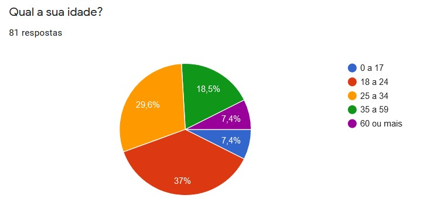
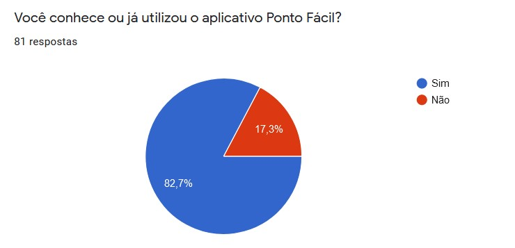
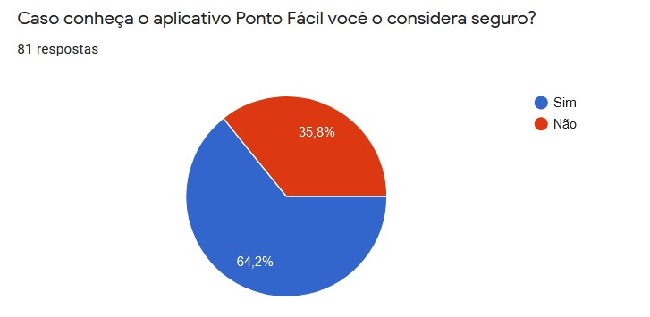
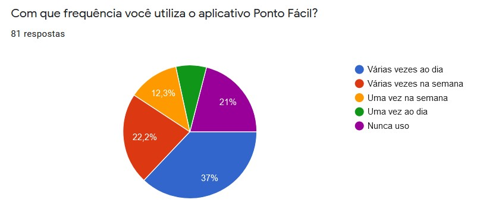
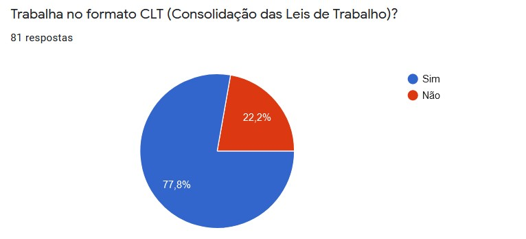
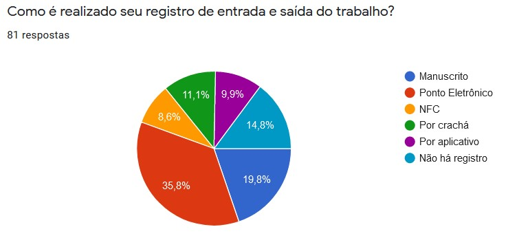
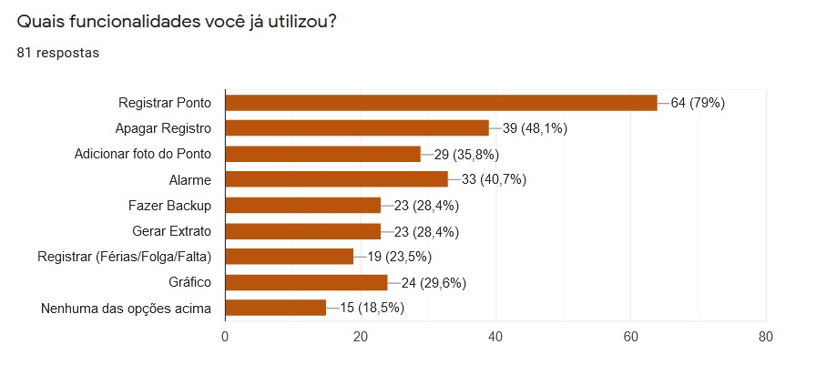
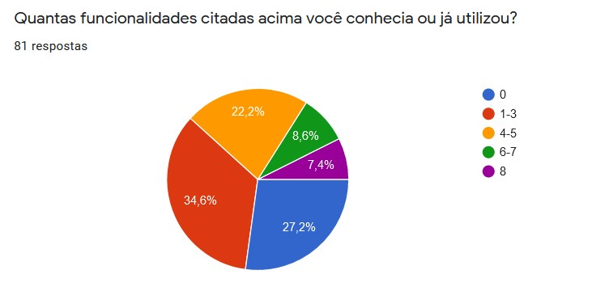
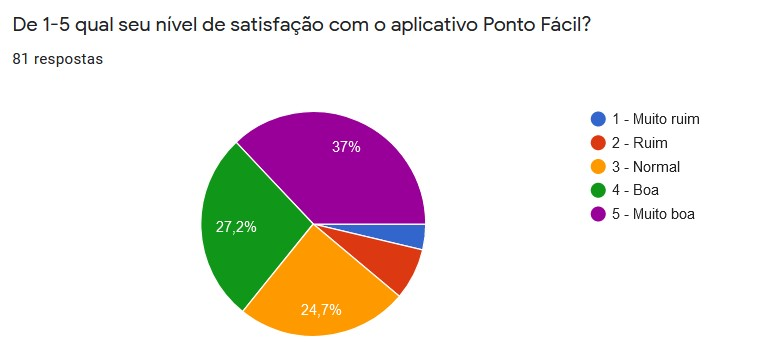

# 
 Questionário

## Histórico de versão 

|    Data    | Versão |                Modificação                |       Autor        |
| :-------- | :---- | :--------------------------------------- | :---------------- |
| 18/02/2022 |  0.1   | Criação do documento e elaboração do texto |  [José Luís](https://github.com/joseluis-rt)   |
| 18/02/2022 |  0.2   | Adição de imagens e participantes |  [José Luís](https://github.com/joseluis-rt)   |
| 18/02/2022 |  0.3   | Revisão |  [Eduardo Maia](https://github.com/eduardomr)   |

## 1.Definição

&emsp;&emsp;
  Os questionários são usados principalmente como uma ferramenta simples, que através de perguntas durante a fase inicial da elicitação, servem para coletar possíveis requisitos de pessoas em lugares diversos, evitando aglomerações e possíveis riscos à saúde, além de não gerar custos para a equipe. Justamente por esses benefícios e facilidades nosso grupo optou por sua utilização.
    

## 2.Metodologia

&emsp;&emsp;Para ter um número satisfatório de dados foi importante evitar questões longas e/ou complexas.

&emsp;&emsp;Através da divulgação e do compartilhamento do questionário, recebemos um total de (81) respostas, alcançando o objetivo que tínhamos com essa técnica e tendo uma boa variedade de respostas para estudo.
  
| Dados Recolhidos em |
|-----------------|
| 12/02/2022 - 18/02/2022 |
    

 
  
#### 2.1 Participantes do Questionário
|Integrantes |
| -- |
|[Eduardo Maia](https://github.com/eduardomr)|
|[Klyssmann Oliveira](https://github.com/kyssmannoliveira)|
|[José Luís Ramos Teixeira](https://github.com/joseluis-rt)|
|[Lorenzo de Lima Alves dos Santos](https://github.com/lorenzo7377)|
|[Kayro César](https://github.com/kayrocesar)|

## 3.Questões
### Questão 1

 

### Questão 2

 

### Questão 3 

 

### Questão 4

 

### Questão 5

 

### Questão 6

 

### Questão 7

 

### Questão 8

 

### Questão 9

 

## 4.Resultados

&emsp;&emsp;
  A técnica de questionários foi importante na construção de personas, priorização das funcionalidades mais utilizadas e identificação do público alvo. A partir dela, também foi possível identificar que a maior parte dos usuários estão satisfeitos com o aplicativo Ponto Fácil.
    

 
  

## 5.Requisitos

&emsp;&emsp;
    Por meio dessa pesquisa foi possível obter informações interessantes. Através dos resultados obtidos com o questionário foi possível identificar a funcionalidade mais utilizada, o nível de satisfação com o aplicativo e a criação de alguns requisitos. Identificar requisitos transmite a ideia de que se está validando a informação a partir de um processo investigativo, agregando bastante valor ao objeto de estudo. 

  
**Legenda**:

* Q: Questionário
* RF: Requisito Funcional
* RNF: Requisito Não Funcional

| ID LOCAL | Requisito | Tipo de requisito |
| -- | -- | -- |
| Q01|  O aplicativo deve garantir a segurança dos dados do usuário | RNF |
| Q02 | O Sistema deve ter layout compreensível e objetivo| RNF |
| Q03 | O aplicativo deve possuir interface acessível e intuitiva| RNF |

## 6.Referências

> [1] - C. E. Vazquez and G. S. Simões,Engenharia de Requisitos:software orientado ao negócio.    Brasport, 2016
