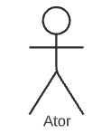
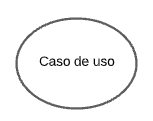
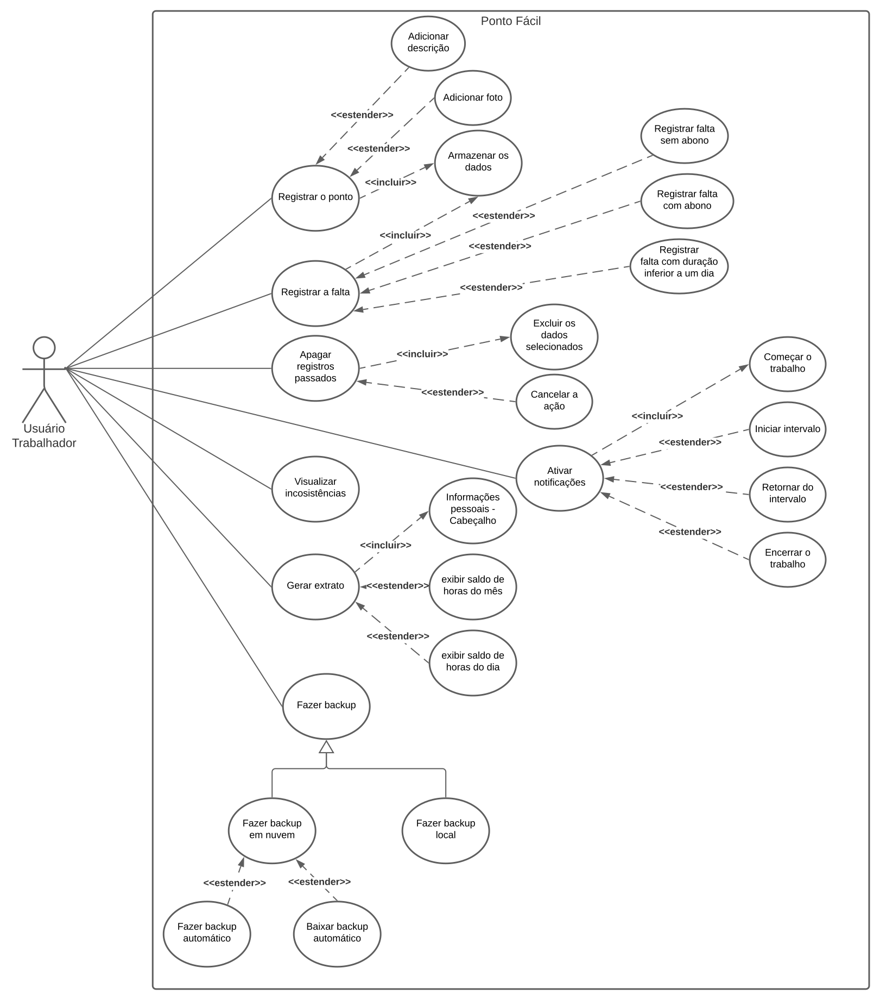

# Casos de Uso

## Histórico de versão

|Data | Versão | Modificação | Autor(es)|
| -- | -- | -- | -- |
| 04/02/2022 | 0.1 | Criação do documento de Casos de Uso | [Kayro César](https://github.com/kayrocesar) |
| 04/03/2022 |  0.2   | Adição da parte téorica do Diagrama de casos de Uso |  [Klyssmann Oliveira](https://github.com/klyssmannoliveira)   |
| 05/03/2022 |  0.3   | Diagrama de casos de Uso |  [Klyssmann Oliveira](https://github.com/klyssmannoliveira) e  [Kayro César](https://github.com/kayrocesar)  |

## 1. Introdução

   Casos de uso são documentos textuais utilizados para especificar requisitos e possuem um detalhamento maior que as histórias de usuário. A recomendação é sejam escritos na fase de especificação dos requisitos e geralmente são escritos pelos próprios desenvolvedores do sistema, mas podem ser compreendidos e validados pelos usuários (VALENTE, 2020).

   Já um diagrama de caso de uso é uma metodologia usada na análise do sistema para identificar, esclarecer e organizar os requisitos do sistema que são empregados em UML (Unified Modeling Language), uma notação padrão para a modelagem de objetos e sistemas do mundo real (ALERYANI, 2016). 

 
    Existem quatro símbolos principais que são utilizados nos diagramas de caso de uso: (1) Atores; (2) Casos de uso; (3) Associação; e (4) Sistema de fronteira. A tabela 1 apresenta estes simbolos.

Tabela 1: Simbolos do Diagrama de Casos de Uso

| Notação | Função | Símbolo |
| :-: | :-- | :-: |
| (1) Atores | é uma pessoa ou um grupo de pessoas fora do sistema desempenha um papel em uma ou mais interações com o sistema, representa de onde a informação vem e para onde vai  |  |
| (2) Casos de uso | mostra todas as funções do sistema  |   |
| (3) Associação | representa a conexão entre casos de uso e atores |   |
| (4) Sistema de fronteira | determina o limite do sistema  |   |

Fonte: Elaboração dos autores.

## 2. Metodologia

    No documento de casos de uso textual, o  primeiro aspecto a ser incluso é a utilização de uma perspectiva de um ator que deseja utilizar o sistema para atingir um determinado objetivo. O ator costuma ser um usuário humano e um elemento externo em relação ao sistema. Primeiramente, o caso de uso enumera os passos a serem realizados pelo ator e cada caso possui duas listas de passos (fluxo normal e extensões. O fluxo normal é o caminho ideal a ser percorrido pelo usuário, já as extensões representam caminhos alternativos na execução de um passo ou possíveis situações de erro (VALENTE, 2020).

 

## 3. Resultados

    Utilizando a metodologia apresentada, foram produzidos os seguintes casos de uso:

 
 

###  3.1. Registrar o ponto 

| Fluxo | Passo |Ação |  Ator | RF |
| :---: | :---: |:---: | :---: | :---: |
| Normal | 
1
 |Funcionário seleciona a opção de registrar o ponto  | Funcionário de uma empresa | [RF01, RF02, RF03, RF08](https://requisitos-de-software.github.io/2021.2-PontoFacil/elicitacao/priorizacao/moscow/) |
| Normal | 
2 
  |Funcionário informa o horário do registro do ponto  |Funcionário de uma empresa | - |
| Normal |
3
 |Funcionário informa alguns dados adicionais acerca do registro do ponto ( foto e descrição )|Funcionário de uma empresa | [RF18, RF31](https://requisitos-de-software.github.io/2021.2-PontoFacil/elicitacao/priorizacao/moscow/) |
| Normal | 
4
 | Aplicativo salva o registro do ponto  |Funcionário de uma empresa|- |
| Normal | 
5
 | Aplicativo mostra que o registro do ponto foi realizado com sucesso |Funcionário de uma empresa|- |
| Extensão| 
2a
 |Funcionário informa um horário inválido (solicitar horário novamente)  |Funcionário de uma empresa |- | 
| Extensão|  
4a
|Funcionário desiste de registrar o ponto |Funcionário de uma empresa |- | 
| Extensão|  
5a
| Aplicativo cancela a operação |Funcionário de uma empresa |- | 

 
 

### 3.2. Registrar falta

| Fluxo | Passo |Ação |  Ator | RF |
| :---: | :---: |:---: | :---: | :---: |
| Normal | 
1
 |Funcionário seleciona a opção de registrar falta  | Funcionário de uma empresa | [RF17](https://requisitos-de-software.github.io/2021.2-PontoFacil/elicitacao/priorizacao/moscow/) |
| Normal | 
2 
  |Funcionário informa a duração da sua falta (dia(s) ou horas) |Funcionário de uma empresa | - |
| Normal |
3
 |Funcionário informa alguns dados acerca do registro da falta|Funcionário de uma empresa | - |
| Normal | 
4
 | Aplicativo salva o registro da falta  |Funcionário de uma empresa|- |
| Normal | 
5
 | Aplicativo mostra que o registro da falta foi realizado com sucesso |Funcionário de uma empresa|- |
| Extensão| 
2a
 |Funcionário informa uma duração  (dias ou horas) inválida (solicitar duração novamente)  |Funcionário de uma empresa |- | 
| Extensão|  
4a
|Funcionário desiste de registrar o ponto|Funcionário de uma empresa |- | 
| Extensão|  
5a
| Aplicativo cancela a operação |Funcionário de uma empresa |- | 

 

  
  
  

### 3.3. Apagar registros passados

| Fluxo | Passo |Ação |  Ator | RF |
| :---: | :---: |:---: | :---: | :---: |
| Normal | 
1
 |Funcionário seleciona o registro desejado  | Funcionário de uma empresa |- |
| Normal | 
2 
  |Funcionário seleciona a opção de apagar |Funcionário de uma empresa | - |
| Normal |
3
 |Aplicativo pergunta se o usuário tem certeza da escolha|Funcionário de uma empresa | - |
| Normal | 
4
 | Aplicativo apaga o registro desejado  |Funcionário de uma empresa|[RF05 e RF23](https://requisitos-de-software.github.io/2021.2-PontoFacil/elicitacao/priorizacao/moscow/)|
| Extensão| 
4a
 |Funcionário desiste de apagar o registro desejado |Funcionário de uma empresa |- | 
| Extensão|  
5a
|Aplicativo cancela a operação|Funcionário de uma empresa |- | 

  
  

### 3.4. Ativar a notificação de alarme 

| Fluxo | Passo |Ação |  Ator | RF |
| :---: | :---: |:---: | :---: | :---: |
| Normal | 
1
 |Funcionário seleciona a opção para ativar a notificação de alarme  | Funcionário de uma empresa | - |
| Normal | 
2 
  |Funcionário escolhe se deseja ativar alarme para começar e terminar o trabalho ou  intervalo   |Funcionário de uma empresa | - |
| Normal |
3
 |Funcionário define se deseja antecipar o alarme  |Funcionário de uma empresa | - |
| Normal | 
4
 | Aplicativo ativa o alarme de acordo com o especificado pelo usuário  |Funcionário de uma empresa|[RF28](https://requisitos-de-software.github.io/2021.2-PontoFacil/elicitacao/priorizacao/moscow/) |

  
  

### 3.5. Realizar Backup dos registros

| Fluxo | Passo |Ação |  Ator | RF |
| :---: | :---: |:---: | :---: | :---: |
| Normal | 
1
 |Funcionário seleciona a opção para realizar o Backup  | Funcionário de uma empresa |- |
| Normal | 
2 
  |Funcionário seleciona o tipo de backup que deseja realizar(local ou nuvem) |Funcionário de uma empresa |  |
| Normal |
3
 |Aplicativo pergunta se o usuário tem certeza da escolha|Funcionário de uma empresa | - |
| Normal | 
4
 | Aplicativo apaga o registro desejado  |Funcionário de uma empresa|[RF28](https://requisitos-de-software.github.io/2021.2-PontoFacil/elicitacao/priorizacao/moscow/)|
| Extensão| 
3a
 |Funcionário desiste fazer o backup |Funcionário de uma empresa |- | 
| Extensão|  
4a
|Aplicativo cancela a operação|Funcionário de uma empresa |- | 

  
  

### 3.6. Gerar extrato de registros

| Fluxo | Passo |Ação |  Ator | RF |
| :---: | :---: |:---: | :---: | :---: |
| Normal | 
1
 |Funcionário seleciona a opção para gerar um extrato dos seus registros  | Funcionário de uma empresa |- |
| Normal | 
2 
  |Funcionário seleciona o intervalo de datas que o extrato deve levar em conta  |Funcionário de uma empresa |-  |
| Normal |
3
 |Funcionário seleciona quais critérios devem ser incluídos no extrato  |Funcionário de uma empresa |-  |
| Normal | 
4
 |Aplicativo gera o extrato  |Funcionário de uma empresa|[RF32](https://requisitos-de-software.github.io/2021.2-PontoFacil/elicitacao/priorizacao/moscow/)|
| Normal | 
5
| Aplicativo informa que o extrato foi gerado e pergunta se o usuário deseja abri-lo  |Funcionário de uma empresa|-|
| Extensão| 
2a
 |Funcionário seleciona o intervalo de datas inválido (solicitar o intervalo novamente) |Funcionário de uma empresa|-|
| Extensão|  
3a
|Funcionário desiste de gerar o extrato|Funcionário de uma empresa |-|
| Extensão|  
4a
|Aplicativo cancela a operação|Funcionário de uma empresa |-|

  
  

### 3.7. Visualizar inconsistências nos registros de ponto 

| Fluxo | Passo |Ação |  Ator | RF |
| :---: | :---: |:---: | :---: | :---: |
| Normal | 
1
 |Funcionário seleciona a opção para visualizar as inconsistências nos registros de ponto | Funcionário de uma empresa |- |
| Normal | 
2 
  |Aplicativo exibe a lista de inconsistências (cada item da lista possui uma data) e a quantidade total das mesmas |Funcionário de uma empresa |[RF12](https://requisitos-de-software.github.io/2021.2-PontoFacil/elicitacao/priorizacao/moscow/)    |

  
  

   

### 3.8. Diagrama de Casos de Uso

  <a href="https://requisitos-de-software.github.io/2021.2-PontoFacil/docs/assets/imagens/diagrama_use_case_PontoFacil.svg" target="_blank">Clique aqui</a> para ver o diagrama com mais detalhes.

## 4. Legenda

RF - Requisito Funcional

## 5. Referências

>VALENTE, Marco Túlio. Engenharia de Software Moderna: Princípios e Práticas para Desenvolvimento de Software com Produtividade, 2020.

>ALERYANI, Arwa Y. Comparative study between data flow diagram and use case diagram. International Journal of Scientific and Research Publications, v. 6, n. 3, p. 124-126, 2016.

