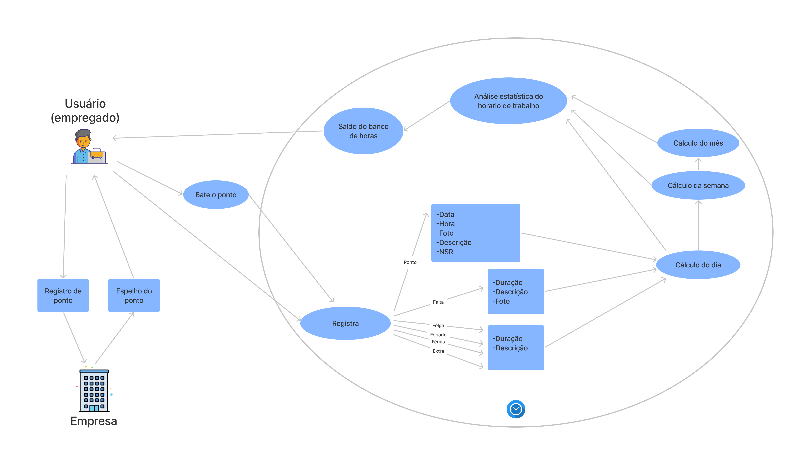

# RichPicture

## 1. Introdução

Um Rich Picture é um desenho que visa representar os principais elementos de um problema para apoiar e proporcionar uma melhor compreensão por parte da equipe de desenvolvimento.

## 2. Metodologia

    Primeiramente,foi realizado um esboço do rich picture para ilustrar uma idéia geral do funcionamento do aplicativo e posteriormente foram realizadas mais duas versões  utilizando a ferramenta <a href="https://www.figma.com/">Figma</a>.

## Esboço

## Versão 1

## Versão 2

## 3. Histórico de Versões

|   Data   | Versão |           Descrição           |             Autor(es)              |
|:--------:|:------:|:-----------------------------:|:----------------------------------:|
| 29/01/2022 |  0.1   |    Esboço do RichPicture    | Klyssmann Oliveira|
| 02/01/2022 |  1.0   |  RichPicture realizado no [Figma]("https://www.figma.com/")  |  Kayro César|
| 03/01/2022 |  2.0   |  RichPicture aprimorado no [Figma]("https://www.figma.com/")  |  Kayro César|
